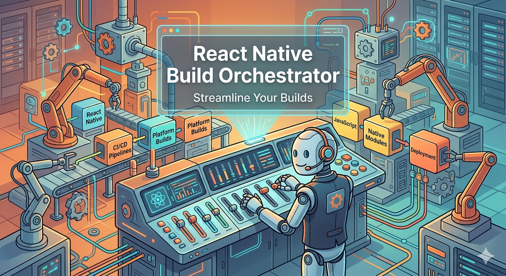

# react-native-build-orchestrator

CLI workflow manager for React Native projects that standardizes environment handling, flavor-aware Android/iOS builds, version updates, and Fastlane uploads.



## Why use it

React Native release pipelines often drift across projects because build commands, env files, schemes, and store steps are handled differently by each team. This package provides one command-line workflow to:

- Detect and manage environments (`.env*` + custom vars)
- Manage Android flavors and iOS schemes
- Run debug and archive builds with guided prompts or flags
- Update Android and iOS versions consistently
- Upload artifacts through Fastlane with lane/track defaults
- Run build + upload in one release pipeline (`rnbuild release`)

## Features

- Interactive and non-interactive CLI commands
- Typed runtime env exports for app code (`src/config/env.ts`)
- Native env export artifacts for Android and iOS
- Flavor-aware command rewriting for Gradle and iOS scheme usage
- Artifact-aware release pipeline (`apk`, `aab`, `ipa`)
- Fastlane setup wizard (`Fastfile` + `Appfile` generation)

## Requirements

- Node.js `>=20.18.0`
- Yarn 3+ recommended
- React Native CLI project structure (`android/`, `ios/`)
- Fastlane installed for upload steps (`bundle exec fastlane` preferred)

## Installation

```bash
yarn add -D react-native-build-orchestrator
```

Run without installation:

```bash
yarn dlx react-native-build-orchestrator init
```

## Quick Start

```bash
# 1) Initialize config
yarn rnbuild init

# 2) Verify project
yarn rnbuild doctor

# 3) Run debug app with selected env
yarn rnbuild run

# 4) Build and upload to store in one command
yarn rnbuild release --env production --platform android --type store
```

## Commands

### init

Creates `.rnbuildrc.yml` and auto-detects project metadata.

```bash
yarn rnbuild init
yarn rnbuild init --force
yarn rnbuild init --project-name MyApp
```

### doctor

Checks if current directory looks like a valid React Native project.

```bash
yarn rnbuild doctor
```

### run

Runs app in debug mode with selected environment/flavor.

```bash
yarn rnbuild run
yarn rnbuild run --env development --platform ios --flavor clientA
```

### build

Runs configured build profile.

```bash
yarn rnbuild build
yarn rnbuild build --env production --type store --platform android --android-artifact bundle
yarn rnbuild build --env production --type adhoc --platform ios --flavor clientA --fast
```

### version

Updates Android and iOS version values in one flow.

```bash
yarn rnbuild version
yarn rnbuild version --version 1.5.0 --android-build-number 150 --ios-build-number 150
yarn rnbuild version --all-flavors --version 1.5.1 --android-build-number 151 --ios-build-number 151
```

### env

Environment management.

```bash
yarn rnbuild env list
yarn rnbuild env add
yarn rnbuild env edit
yarn rnbuild env remove
yarn rnbuild env set-default production
yarn rnbuild env detect
```

### flavor

Flavor/scheme management.

```bash
yarn rnbuild flavor list
yarn rnbuild flavor detect
yarn rnbuild flavor add android flavorA
yarn rnbuild flavor set-default ios clientA
```

### fastlane setup

Generates `fastlane/Fastfile` and `fastlane/Appfile`, and stores defaults in config.

```bash
yarn rnbuild fastlane setup
yarn rnbuild fastlane setup --force
```

### release

Builds and uploads to store in one unified pipeline. **Always builds first, then uploads** for any chosen environment, platform, flavor, and artifact type.

```bash
# Interactive prompts for environment, platform, flavor, build type, lane, and track
yarn rnbuild release

# Non-interactive: Android AAB to internal track
yarn rnbuild release --env production --platform android --type store --android-artifact bundle --lane upload_store --track internal

# Non-interactive: iOS to TestFlight
yarn rnbuild release --env production --platform ios --type store --lane upload_store --track testflight

# With custom artifact path
yarn rnbuild release --env production --platform android --type store --artifact-path android/app/build/outputs/bundle/release/app-release.aab

# Dry run: preview build and upload commands without executing
yarn rnbuild release --env production --platform android --dry-run

# Fast mode: apply platform optimizations for faster builds
yarn rnbuild release --env production --platform ios --type store --fast
```

## Configuration

Generated config file: `.rnbuildrc.yml`

Minimal example:

```yaml
projectName: my-rn-app
defaultEnvironment: development
environments:
  development:
    envFile: .env.development
    vars:
      BASE_URL: https://dev-api.example.com
  production:
    envFile: .env.production
    vars:
      BASE_URL: https://api.example.com
builds:
  development:
    android:
      enabled: true
      command: cd android && ./gradlew assembleDebug
    ios:
      enabled: true
      command: xcodebuild -workspace ios/{{PROJECT_NAME}}.xcworkspace -scheme {{PROJECT_NAME}} -configuration Debug -sdk iphonesimulator -derivedDataPath ios/build
  adhoc:
    android:
      enabled: true
      androidArtifact: apk
      command: cd android && ./gradlew assembleRelease
    ios:
      enabled: true
      command: xcodebuild -workspace ios/{{PROJECT_NAME}}.xcworkspace -scheme {{PROJECT_NAME}} -configuration Release -archivePath ios/build/{{PROJECT_NAME}}.xcarchive archive
  store:
    android:
      enabled: true
      androidArtifact: bundle
      command: cd android && ./gradlew bundleRelease
    ios:
      enabled: true
      command: xcodebuild -workspace ios/{{PROJECT_NAME}}.xcworkspace -scheme {{PROJECT_NAME}} -configuration Release -archivePath ios/build/{{PROJECT_NAME}}.xcarchive archive
```

## Runtime Environment Exports

Before `run`, `build`, and `release`, the tool writes:

- `.rnbuild/active.env`
- `rnbuild.env.ts`
- `src/config/env.ts`
- `android/app/src/main/assets/rnbuild_env.json`
- `android/app/src/main/res/values/rnbuild_env.xml`
- `RNBUILD_*` keys in `ios/**/Info.plist`

JS usage:

```ts
import Config from "../config/env";

const baseUrl = Config.BASE_URL;
```

Native usage examples:

Android (Kotlin):

```kotlin
val input = reactApplicationContext.assets.open("rnbuild_env.json")
val json = input.bufferedReader().use { it.readText() }
```

iOS (Swift):

```swift
let baseUrl = Bundle.main.object(forInfoDictionaryKey: "RNBUILD_BASE_URL") as? String
```

## Templating

Supported placeholders in build commands and output hints:

- `{{PROJECT_NAME}}`
- `{{ENV_NAME}}`
- `{{BUILD_TYPE}}`
- `{{PLATFORM}}`
- `{{FLAVOR}}`
- `{{FLAVOR_NAME}}`
- `{{FLAVOR_VALUE}}`
- `{{FLAVOR_TASK}}`
- Any key from selected env file or env vars

## CI Usage

Typical non-interactive usage:

```bash
yarn rnbuild release \
  --env production \
  --platform android \
  --type store \
  --android-artifact bundle \
  --lane upload_store \
  --track internal
```

For reproducible Fastlane runs in CI, use Bundler and prefer `bundle exec fastlane`.

## Security Note

Environment files in mobile apps should not be treated as secret storage. Do not embed long-lived secrets in app-delivered env data.

## Development

```bash
yarn install
yarn test
yarn build
```

Additional testing guidance: `TESTING.md`

## Project Formalities

- License: [MIT](LICENSE)
- Contributing guide: [CONTRIBUTING.md](CONTRIBUTING.md)
- Security policy: [SECURITY.md](SECURITY.md)
- Code of conduct: [CODE_OF_CONDUCT.md](CODE_OF_CONDUCT.md)

## Roadmap

The following items are intentionally kept as future work so maintainers and open source contributors can pick them up.

### Phase 1: CI and automation

- CI mode with structured JSON output (`--ci`, machine-readable summaries)
- Non-interactive validation mode for pipelines (`rnbuild doctor --ci`)
- GitHub Actions examples for Android AAB and iOS IPA releases
- Better exit-code mapping for build vs upload failures

### Phase 2: Release pipeline hardening

- Artifact validation before upload (checksum, extension, existence checks)
- Build manifest output (`.rnbuild/release-manifest.json`) with env/flavor/artifact metadata
- Retry strategy for transient Fastlane/store API failures
- Better diagnostics for Fastlane lane failures with summarized root causes

### Phase 3: Extensibility

- Plugin hooks for org-specific workflows (pre-build, post-build, pre-upload, post-upload)
- Custom template packs for command generation
- Shared monorepo presets for multi-app React Native workspaces

### Phase 4: Ecosystem support

- EAS adapter support (Expo workflows)
- Optional integration adapters for Slack/webhook notifications
- Optional release notes/changelog attachment support for store uploads

### Good First Contribution Ideas

- Add JSON schema docs for `.rnbuildrc.yml`
- Add `rnbuild release --summary` output mode
- Add richer lane option docs and examples in README
- Improve `doctor` checks for missing Fastlane/Bundler prerequisites
