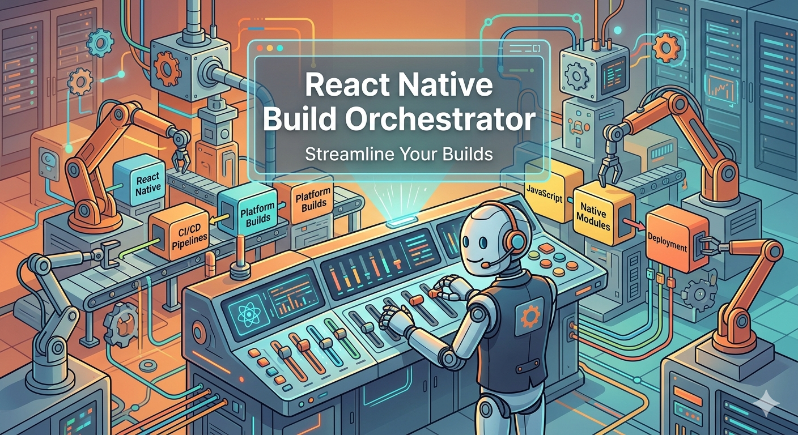

# react-native-build-orchestrator

 [](https://codecov.io/github/bhishaksanyal/react-native-build-orchestrator) [](https://www.codefactor.io/repository/github/bhishaksanyal/react-native-build-orchestrator)         

CLI workflow manager for React Native projects that standardizes environment handling, flavor-aware Android/iOS builds, version updates, and Fastlane uploads.



## Why use it

React Native release pipelines often drift across projects because build commands, env files, schemes, and store steps are handled differently by each team. This package provides one command-line workflow to:

- Detect and manage environments (`.env*` + custom vars)
- Manage Android flavors and iOS schemes
- Run debug and archive builds with guided prompts or flags
- Update Android and iOS versions consistently
- Upload artifacts through Fastlane with lane/track defaults
- Run build + upload in one release pipeline (`rnbuild release`)

## Features

- Interactive and non-interactive CLI commands
- Typed runtime env exports for app code (`src/config/env.ts`)
- Native env export artifacts for Android and iOS
- Flavor-aware command rewriting for Gradle and iOS scheme usage
- Artifact-aware release pipeline (`apk`, `aab`, `ipa`)
- Fastlane setup wizard (`Fastfile` + `Appfile` generation)

## Requirements

- Node.js `>=20.18.0`
- Yarn 3+ recommended
- React Native CLI project structure (`android/`, `ios/`)
- Fastlane installed for upload steps (`bundle exec fastlane` preferred)

## Installation

```bash
yarn add -D react-native-build-orchestrator
```

Run without installation:

```bash
yarn dlx react-native-build-orchestrator init
```

## Quick Start

```bash
# 1) Initialize config
yarn rnbuild init

# 2) Verify project
yarn rnbuild doctor

# 3) Run debug app with selected env
yarn rnbuild run

# 4) Build and upload to store in one command
yarn rnbuild release --env production --platform android --type store
```

## Commands

### init

Creates `.rnbuildrc.yml` and auto-detects project metadata.

```bash
yarn rnbuild init
yarn rnbuild init --force
yarn rnbuild init --project-name MyApp
```

### doctor

Checks if current directory looks like a valid React Native project.

```bash
yarn rnbuild doctor
```

### run

Runs app in debug mode with selected environment/flavor.

```bash
yarn rnbuild run
yarn rnbuild run --env development --platform ios --flavor clientA
```

### build

Runs configured build profile.

```bash
yarn rnbuild build
yarn rnbuild build --env production --type store --platform android --android-artifact bundle
yarn rnbuild build --env production --type adhoc --platform ios --flavor clientA --fast
```

### version

Updates Android and iOS version values in one flow.

```bash
yarn rnbuild version
yarn rnbuild version --version 1.5.0 --android-build-number 150 --ios-build-number 150
yarn rnbuild version --all-flavors --version 1.5.1 --android-build-number 151 --ios-build-number 151
```

### env

Environment management.

```bash
yarn rnbuild env list
yarn rnbuild env add
yarn rnbuild env edit
yarn rnbuild env remove
yarn rnbuild env set-default production
yarn rnbuild env detect
```

### flavor

Flavor/scheme management.

```bash
yarn rnbuild flavor list
yarn rnbuild flavor detect
yarn rnbuild flavor add android flavorA
yarn rnbuild flavor set-default ios clientA
```

### fastlane setup

Generates `fastlane/Fastfile` and `fastlane/Appfile`, and stores defaults in config.

```bash
yarn rnbuild fastlane setup
yarn rnbuild fastlane setup --force
```

## Fastlane Lane Options

When `rnbuild release` runs the upload phase, it invokes a Fastlane lane and passes runtime options via command-line parameters. Understanding these options lets you customize the generated `Fastfile` for your workflow.

### How the upload command is built

The release command constructs a Fastlane invocation like this:

```bash
bundle exec fastlane android upload_store \
  track:"internal" \
  artifact_type:"aab" \
  artifact_path:"/path/to/app-release.aab"
```

Each parameter after the lane name is a Fastlane option passed as `key:"value"` pairs. The generated `Fastfile` reads these options with `options[:track]`, `options[:artifact_type]`, and `options[:artifact_path]`.

### Options reference

| Option | Type | Default | Platform | Description |
|---|---|---|---|---|
| `track` | String | Config default or `"internal"` (Android) / `"testflight"` (iOS) | Both | Store track or destination. Android: `internal`, `alpha`, `beta`, `production`. iOS: `testflight`, `app_store`. |
| `artifact_type` | String | `"aab"` for Android bundle, `"apk"` for Android APK, `"ipa"` for iOS | Both | Type of build artifact being uploaded. Used by the generated Fastfile to decide `supply` vs `pilot`/`deliver` arguments. |
| `artifact_path` | String | Derived from `outputHint` in config or prompted | Both | Absolute or relative path to the build artifact file. |

### How the generated Fastfile works

The `rnbuild fastlane setup` command generates a `Fastfile` with two platform-specific lanes:

**Android (`upload_store` by default):**
- Uses the `supply` action to upload to Google Play Console.
- Auto-detects whether the artifact is an AAB or APK based on `artifact_type` and file extension.
- Skips metadata, images, and screenshots uploads (edit the Fastfile to include them).
- Accepts a custom `track` option (defaults to your configured default track).

```ruby
platform :android do
  lane :upload_store do |options|
    track_name = options[:track] || "internal"
    artifact_path = options[:artifact_path]

    supply_options = {
      track: track_name,
      skip_upload_metadata: true,
      skip_upload_images: true,
      skip_upload_screenshots: true
    }

    if artifact_path && !artifact_path.to_s.empty?
      normalized = artifact_path.to_s.downcase
      if options[:artifact_type].to_s == "aab" || normalized.end_with?(".aab")
        supply_options[:aab] = artifact_path
      else
        supply_options[:apk] = artifact_path
      end
    end

    supply(supply_options)
  end
end
```

**iOS (`upload_store` by default):**
- Uses `deliver` for App Store Connect submissions (with `submit_for_review: false` by default).
- Uses `pilot` (TestFlight) for TestFlight destination.
- Accepts a custom `track` option (`"testflight"` or `"app_store"`).

```ruby
platform :ios do
  lane :upload_store do |options|
    destination = options[:track] || "testflight"
    artifact_path = options[:artifact_path]

    if destination == "app_store"
      deliver_options = {
        submit_for_review: false,
        automatic_release: false,
        skip_metadata: true,
        skip_screenshots: true
      }
      deliver_options[:ipa] = artifact_path if artifact_path
      deliver(deliver_options)
    else
      pilot_options = { skip_waiting_for_build_processing: true }
      pilot_options[:ipa] = artifact_path if artifact_path
      pilot(pilot_options)
    end
  end
end
```

### Customizing lanes

Edit the generated `fastlane/Fastfile` to add custom behavior while keeping the same lane name so `rnbuild release --lane` continues to work:

```ruby
# Custom Android lane with changelog upload
lane :upload_store do |options|
  # ... standard upload logic ...

  # Add custom steps
  upload_to_play_store(
    track: options[:track] || "internal",
    aab: options[:artifact_path],
    release_status: "completed"
  )
end
```

### Using multiple lanes

Configure multiple lanes in your `Fastfile` and select them at release time:

```bash
# Default store upload
yarn rnbuild release --env production --platform android --type store --lane upload_store

# Nightly build with different upload logic
yarn rnbuild release --env nightly --platform android --type store --lane upload_nightly

# Beta deployment with custom track
yarn rnbuild release --env staging --platform ios --type adhoc --lane upload_beta --track testflight
```

Set the default lane per platform in `.rnbuildrc.yml`:

```yaml
fastlane:
  android:
    lane: upload_store
    defaultTrack: internal
    packageName: com.example.app
  ios:
    lane: upload_store
    defaultTrack: testflight
    appIdentifier: com.example.app
    appleId: developer@example.com
    teamId: ABC123DEFG
```

### Fastlane authentication

The upload actions require proper credentials in your CI environment or local keychain:

**Android (Google Play):**

```bash
# Service account JSON key (recommended)
export SUPPLY_JSON_KEY_DATA='{"type": "service_account", ...}'

# Or file-based authentication
# export SUPPLY_JSON_KEY=/path/to/key.json
```

**iOS (App Store Connect):**

```bash
# API Key authentication (recommended over apple_id/password)
export APP_STORE_CONNECT_API_KEY_KEY_ID="ABC123DEFG"
export APP_STORE_CONNECT_API_KEY_ISSUER_ID="xxxxxxxx-xxxx-xxxx-xxxx-xxxxxxxxxxxx"
export APP_STORE_CONNECT_API_KEY_KEY="path/to/AuthKey_ABC123DEFG.p8"

# Or use apple_id + app_specific_password (legacy)
export FASTLANE_USER="developer@example.com"
export FASTLANE_PASSWORD="@env MY_APP_SPECIFIC_PASSWORD"
```

### Bundler setup for CI

For reproducible Fastlane runs across machines, use Bundler:

```ruby
# Gemfile
source "https://rubygems.org"

gem "fastlane"
```

```bash
bundle install
bundle exec fastlane add_plugin supply  # Android only
```

The release command auto-detects `bundle exec fastlane` and falls back to `fastlane` if Bundler isn't available.

### Full CI pipeline example

See the [GitHub Actions example](examples/github-actions/release.yml) for a complete build-and-release workflow covering both platforms with all secrets configured.

### Troubleshooting

| Error | Likely cause | Fix |
|---|---|---|
| `Fastlane upload failed` | Build artifact not found or Fastlane exit code non-zero | Check `artifact_path` exists and Fastlane credentials are set |
| `Artifact path is required` | No `outputHint` in config and no `--artifact-path` flag | Add `outputHint` to your build target or pass `--artifact-path` |
| `No flavors configured` | `--flavor` used but no flavors in config | Run `rnbuild flavor detect` or configure flavors in `.rnbuildrc.yml` |
| Fastlane credential errors | Missing environment variables for store authentication | Set `SUPPLY_JSON_KEY_DATA` (Android) or `APP_STORE_CONNECT_*` (iOS) |

### release

Builds and uploads to store in one unified pipeline. **Always builds first, then uploads** for any chosen environment, platform, flavor, and artifact type.

```bash
# Interactive prompts for environment, platform, flavor, build type, lane, and track
yarn rnbuild release

# Non-interactive: Android AAB to internal track
yarn rnbuild release --env production --platform android --type store --android-artifact bundle --lane upload_store --track internal --ci

# Non-interactive: iOS to TestFlight
yarn rnbuild release --env production --platform ios --type store --lane upload_store --track testflight --ci

# With custom artifact path
yarn rnbuild release --env production --platform android --type store --artifact-path android/app/build/outputs/bundle/release/app-release.aab

# Dry run: preview build and upload commands without executing
yarn rnbuild release --env production --platform android --dry-run

# Fast mode: apply platform optimizations for faster builds
yarn rnbuild release --env production --platform ios --type store --fast

# Print a concise summary after the release completes
yarn rnbuild release --env production --platform android --type store --summary
```

The `--summary` flag prints a compact, human-readable summary block after a successful release, showing project name, environment, platform, flavor, artifact path, upload destination, and status:

```
── Release Summary ──────────────────────────────────────
  Project:      MyApp
  Environment:  production
  Platform:     android
  Build type:   store
  Artifact:     android/app/build/outputs/bundle/release/app-release.aab
  Upload:       upload_store → internal
  Status:       ✔ success
──────────────────────────────────────────────────────────
```

## Configuration

Generated config file: `.rnbuildrc.yml`

> **JSON Schema** — A [JSON Schema](schemas/rnbuildrc.schema.json) is available for `.rnbuildrc.yml`. Most YAML editors (VS Code, JetBrains, Neovim with YAML plugins) will automatically pick it up from the `$schema` key in the file and provide autocompletion, hover descriptions, and validation as you edit.

Minimal example:

```yaml
$schema: https://raw.githubusercontent.com/bhishaksanyal/react-native-build-orchestrator/main/schemas/rnbuildrc.schema.json
projectName: my-rn-app
defaultEnvironment: development
environments:
  development:
    envFile: .env.development
    vars:
      BASE_URL: https://dev-api.example.com
  production:
    envFile: .env.production
    vars:
      BASE_URL: https://api.example.com
builds:
  development:
    android:
      enabled: true
      command: cd android && ./gradlew assembleDebug
    ios:
      enabled: true
      command: xcodebuild -workspace ios/{{PROJECT_NAME}}.xcworkspace -scheme {{PROJECT_NAME}} -configuration Debug -sdk iphonesimulator -derivedDataPath ios/build
  adhoc:
    android:
      enabled: true
      androidArtifact: apk
      command: cd android && ./gradlew assembleRelease
    ios:
      enabled: true
      command: xcodebuild -workspace ios/{{PROJECT_NAME}}.xcworkspace -scheme {{PROJECT_NAME}} -configuration Release -archivePath ios/build/{{PROJECT_NAME}}.xcarchive archive
  store:
    android:
      enabled: true
      androidArtifact: bundle
      command: cd android && ./gradlew bundleRelease
    ios:
      enabled: true
      command: xcodebuild -workspace ios/{{PROJECT_NAME}}.xcworkspace -scheme {{PROJECT_NAME}} -configuration Release -archivePath ios/build/{{PROJECT_NAME}}.xcarchive archive
```

## Runtime Environment Exports

Before `run`, `build`, and `release`, the tool writes:

- `.rnbuild/active.env`
- `rnbuild.env.ts`
- `src/config/env.ts`
- `android/app/src/main/assets/rnbuild_env.json`
- `android/app/src/main/res/values/rnbuild_env.xml`
- `RNBUILD_*` keys in `ios/**/Info.plist`

JS usage:

```ts
import Config from "../config/env";

const baseUrl = Config.BASE_URL;
```

Native usage examples:

Android (Kotlin):

```kotlin
val input = reactApplicationContext.assets.open("rnbuild_env.json")
val json = input.bufferedReader().use { it.readText() }
```

iOS (Swift):

```swift
let baseUrl = Bundle.main.object(forInfoDictionaryKey: "RNBUILD_BASE_URL") as? String
```

## Templating

Supported placeholders in build commands and output hints:

- `{{PROJECT_NAME}}`
- `{{ENV_NAME}}`
- `{{BUILD_TYPE}}`
- `{{PLATFORM}}`
- `{{FLAVOR}}`
- `{{FLAVOR_NAME}}`
- `{{FLAVOR_VALUE}}`
- `{{FLAVOR_TASK}}`
- Any key from selected env file or env vars

## CI Usage & Structured JSON Output

The `--ci` flag can be added to most commands to run them in a non-interactive mode. In this mode, prompts are disabled (missing required arguments will throw an error), standard informational logs are redirected to `stderr`, and a single, structured JSON object is output to `stdout` upon completion. This is ideal for CI/CD pipelines to parse outputs programmatically.

Example non-interactive release:

```bash
yarn rnbuild release \
  --env production \
  --platform android \
  --type store \
  --android-artifact bundle \
  --lane upload_store \
  --track internal \
  --ci
```

Example JSON output structure (from `stdout`):
```json
{
  "status": "success",
  "projectDir": "/path/to/project",
  "environment": "production",
  "platform": "android",
  "flavor": "",
  "buildType": "store",
  "upload": {
    "lane": "upload_store",
    "track": "internal",
    "artifactPath": "/path/to/project/android/app/build/outputs/bundle/release/app-release.aab"
  }
}
```

If an error occurs in CI mode, the tool will exit with a non-zero status code and output a JSON error object to `stdout`:
```json
{
  "status": "error",
  "command": "release",
  "message": "Artifact path is required for upload."
}
```

For reproducible Fastlane runs in CI, use Bundler and prefer `bundle exec fastlane`.

## Security Note

Environment files in mobile apps should not be treated as secret storage. Do not embed long-lived secrets in app-delivered env data.

## Development

```bash
yarn install
yarn test
yarn build
```

Additional testing guidance: `TESTING.md`

## Project Formalities

- License: [MIT](LICENSE)
- Contributing guide: [CONTRIBUTING.md](CONTRIBUTING.md)
- Security policy: [SECURITY.md](SECURITY.md)
- Code of conduct: [CODE_OF_CONDUCT.md](CODE_OF_CONDUCT.md)

## Roadmap

The following items are intentionally kept as future work so maintainers and open source contributors can pick them up.

### Phase 1: CI and automation

- ~~CI mode with structured JSON output (`--ci`, machine-readable summaries)~~
- ~~Non-interactive validation mode for pipelines (`rnbuild doctor --ci`)~~
- ~~GitHub Actions examples for Android AAB and iOS IPA releases~~
- Better exit-code mapping for build vs upload failures

### Phase 2: Release pipeline hardening

- Artifact validation before upload (checksum, extension, existence checks)
- Build manifest output (`.rnbuild/release-manifest.json`) with env/flavor/artifact metadata
- Retry strategy for transient Fastlane/store API failures
- Better diagnostics for Fastlane lane failures with summarized root causes

### Phase 3: Extensibility

- Plugin hooks for org-specific workflows (pre-build, post-build, pre-upload, post-upload)
- Custom template packs for command generation
- Shared monorepo presets for multi-app React Native workspaces

### Phase 4: Ecosystem support

- EAS adapter support (Expo workflows)
- Optional integration adapters for Slack/webhook notifications
- Optional release notes/changelog attachment support for store uploads

### Good First Contribution Ideas

- ~~Add JSON schema docs for `.rnbuildrc.yml`~~
- ~~Add `rnbuild release --summary` output mode~~
- ~~Add richer lane option docs and examples in README~~
- Improve `doctor` checks for missing Fastlane/Bundler prerequisites
